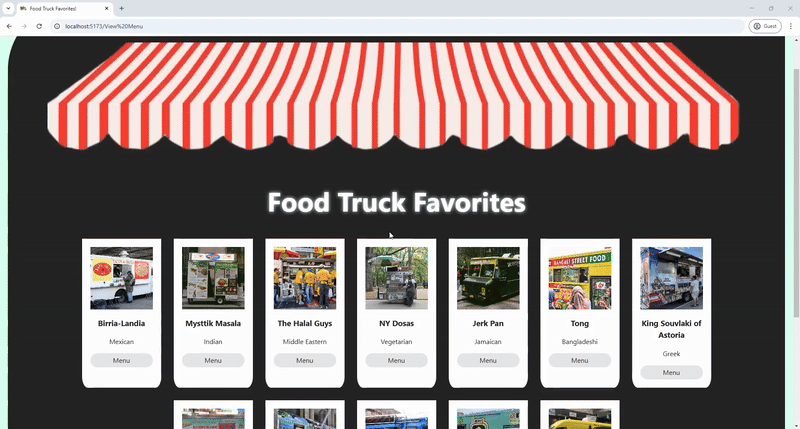

## 🎯 Goals

- [x] Initialize a new React application with Vite
- [x] Create a functional React component
- [x] Define and pass props to components
- [x] dApply CSS styling to React components

## ⭐ Required Features

- [x] Create a unique theme for events or resources relevant to a specific community
- [x] Display at least 10 unique resources or events in a responsive card format

 

GIF created with [Ezgif](https://ezgif.com/)
